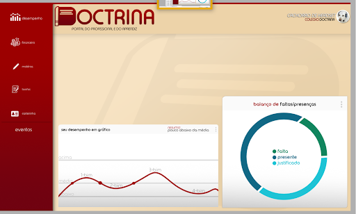
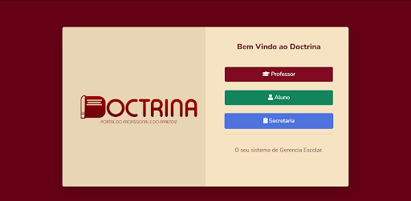

# Projeto Doctrina

Bem-vindo ao repositório oficial do **Doctrina**, um LMS revolucionário que visa transformar a experiência educacional por meio da tecnologia. Desenvolvido para promover eficiência, interação e personalização, o Doctrina supera os desafios enfrentados atualmente na área educacional.

## Visão Geral

O **Doctrina** é um Learning Management System (LMS) projetado para oferecer uma plataforma robusta e intuitiva, focada em facilitar a gestão educacional e melhorar a experiência tanto para professores quanto para alunos. Com recursos abrangentes e uma interface intuitiva, o Doctrina permite:

- **Gestão de Atividades:** Facilita aos professores o gerenciamento de atividades educacionais de forma organizada e eficiente.
- **Compartilhamento de Materiais:** Permite o compartilhamento fácil e seguro de materiais didáticos e recursos educacionais.
- **Acompanhamento de Desempenho:** Oferece ferramentas para monitorar o progresso dos alunos e fornecer feedback personalizado.
- **Experiência de Aprendizagem Dinâmica:** Proporciona aos alunos uma experiência interativa e dinâmica, com acesso facilitado a conteúdos e recursos educacionais.

## Tecnologias Utilizadas

O projeto Doctrina utiliza tecnologias modernas para garantir segurança, usabilidade e desempenho:

- **Frontend:** CSS personalizado com foco em usabilidade e acessibilidade. Utilização do framework Bootstrap para desenvolvimento ágil.
- **CSS Organizado:** Utilização do SCSS para manter uma estrutura de estilos organizada e escalável.
- **Backend:** Utilização do PHP para a lógica de negócios e dinamismo da plataforma.
- **Banco de Dados:** MySQL (ou MariaDB) para armazenamento seguro e eficiente dos dados.
- **Organização de Equipe:** Utilizamos princípios da métodologia ágil Scrum para mediar os ciclos de trabalho dos integrantes da equipe.

## Princípios Fundamentais

O **Doctrina** é fundamentado nos princípios de eficiência, colaboração e personalização:

- **Eficiência:** Simplifica processos educacionais complexos para otimizar o tempo de professores e alunos.
- **Colaboração:** Facilita a interação entre alunos, professores e administradores por meio de canais de comunicação integrados.
- **Personalização:** Oferece uma experiência educacional adaptável às necessidades individuais dos alunos e professores.

## Screenshots

.png)
.jpg)
.png)
.png)

## Contribuições

Contribuições são bem-vindas! Sinta-se à vontade para explorar o código-fonte, sugerir melhorias e reportar problemas. Juntos, podemos fazer do **Doctrina** uma ferramenta ainda mais poderosa para a comunidade educacional.

## Contato

Para mais informações sobre o projeto **Doctrina**, entre em contato conosco [gabriel.barbosadesouza.dev@gmail.com].

---

**Doctrina** - Transformando a educação com tecnologia.
